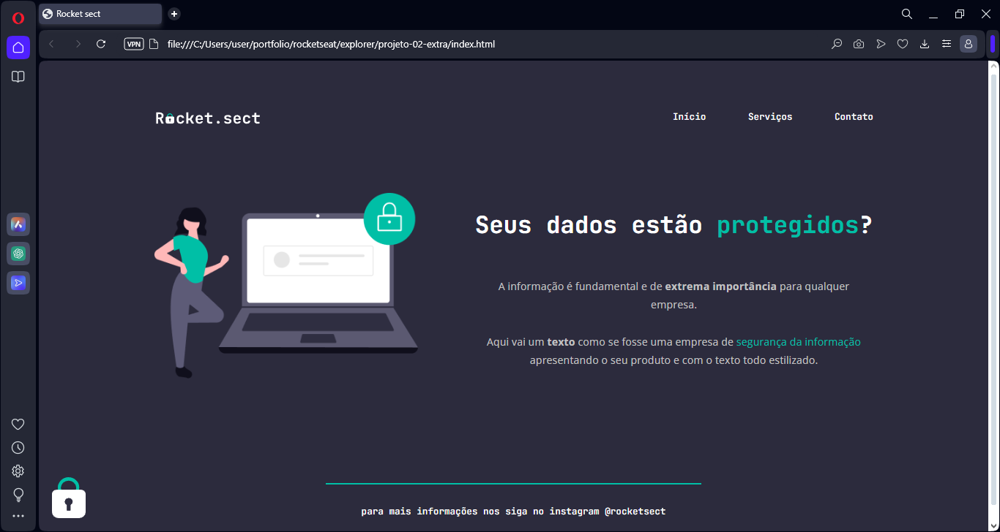

# explorer-proj02-extra
Projeto 02 extra criado para o stage 02 da formação explorer da Rocketseat. O exercício pedia para reproduzir com código o layout criado no figma. 

Aqui está como o código aparecer no navegador:

